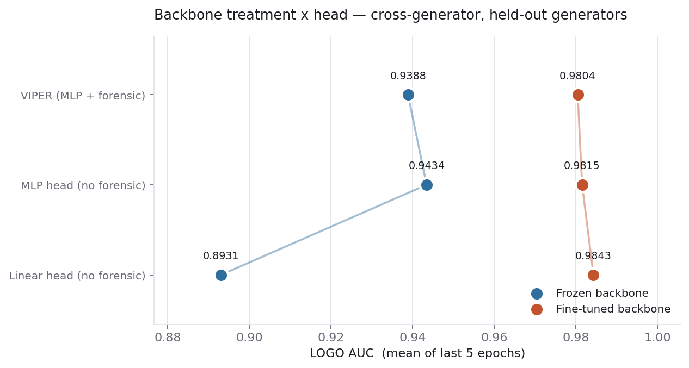
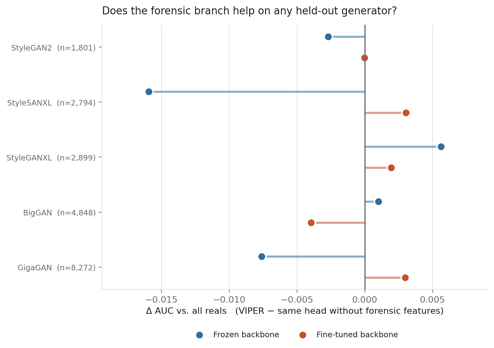

# VIPER — Visual Intelligence Pipeline for Empirical Recognition

Binary classifiers that separate AI-generated images from real photographs,
plus the forensic-feature and interpretability tooling around them.

This repository is a **research record**, not a product. Its purpose is a
controlled answer to one question: *do hand-crafted forensic features add
anything to a CNN that already sees the same pixels?* Every metric below comes
from one corpus build, one manifest and one seed, so the arms are directly
comparable — and the answer turned out to be no, for a reason worth reading.

- **Full results report:** [`results/RESULTS.md`](results/RESULTS.md)
- **Charts and per-model CSVs:** [`results/comparison/`](results/comparison/)
- **Weights, licence and limits:** [`checkpoints/MODEL_CARD.md`](checkpoints/MODEL_CARD.md)

---

## Naming convention

```
VIPER-<backbone>-<Frozen|Unfrozen>-<head>
```

The `VIPER` prefix is reserved for configurations that **fuse forensic features
with a backbone**. A model without that branch is a backbone baseline and is
named as one — `ConvNeXt-Frozen-MLP (no forensic)` — so the two are never
conflated in a results table.

| Component | Values | Meaning |
|---|---|---|
| backbone | `ConvNeXt`, `CLIP` | feature extractor |
| state | `Frozen`, `Unfrozen` | whether backbone weights receive gradients |
| head | `Linear`, `MLP` | `Dropout → Linear(768, 2)` vs `Dropout → Linear(768+d, 384) → ReLU → Linear(384, 2)` |

`VIPERConvNeXt.variant_name()` derives this string from the live configuration,
so a model's name cannot drift from what it actually is.

**Frozen** means fully frozen: all four ConvNeXt stage groups *and* the final
LayerNorm, with the backbone held in `eval()` during training so stochastic
depth does not inject noise into features nothing can adapt to.

---

## Headline result

Adding 33 forensic features to a ConvNeXt-Tiny **does not improve
cross-generator detection**, whether the backbone is frozen or fine-tuned.

| Backbone | LR | Linear head | MLP head | **VIPER** (MLP + forensic) | VIPER − MLP |
|---|---|---|---|---|---|
| Frozen | 0.001 | 0.9003 | 0.9334 | **0.9309** | -0.0026 |
| Frozen | 0.0001 | 0.8931 | 0.9434 | **0.9388** | -0.0046 |
| Fine-tuned | 0.0001 | 0.9843 | 0.9815 | **0.9804** | -0.0011 |

*Mean cross-generator (LOGO) AUC over epochs 8–12. Δ is VIPER against its own
MLP control — same head, same capacity, forensic branch removed.*

Two things make that table trustworthy:

**The MLP control is load-bearing.** On a frozen backbone the MLP head *alone*
is worth **+0.050 AUC** over linear — an order of magnitude more than the
forensic effect being measured. Comparing VIPER to the *linear* head would have
reported "+0.045, forensic features work" when the entire gain was head
capacity. The effect reverses when fine-tuned (−0.0028), which is why the
control exists in both rows.

**Both learning rates were run.** A frozen head at the fine-tuning LR would
underfit and make the frozen arms look artificially weak. As it happens the
assumption that frozen heads want a *higher* LR was wrong — 1e-4 beat 1e-3 for
the frozen MLP (0.9434 vs 0.9334) — which is exactly why it was worth checking.

### Why the features do not help

Splitting the effect by distribution turns a null result into a finding. In
**all three** configurations the forensic features raise in-distribution AUC and
lower cross-generator AUC:

| Configuration | val: control | val: VIPER | Δ val | LOGO: control | LOGO: VIPER | Δ LOGO |
|---|---|---|---|---|---|---|
| Frozen, lr 0.001 | 0.9765 | 0.9769 | **+0.0004** | 0.9334 | 0.9309 | **-0.0026** |
| Frozen, lr 0.0001 | 0.9781 | 0.9788 | **+0.0007** | 0.9434 | 0.9388 | **-0.0046** |
| Fine-tuned, lr 0.0001 | 0.9969 | 0.9973 | **+0.0003** | 0.9815 | 0.9804 | **-0.0011** |

That is the signature of a **generator-specific shortcut**. The 33 statistics —
noise residuals, PRNU-style estimates, FFT band ratios — describe the
fingerprint of the particular generators in the training set. The head learns to
lean on them, which pays on generators it has seen and costs on generators it
has not.

The features are not noise. On their own, with no network at all, a logistic
regression over them reaches **0.7646** cross-generator
AUC — far above chance. What they add *on top of a CNN* is precisely the part
that does not transfer.



---

## All model variants

Cross-generator split (LOGO), n = 40,000 held-out-generator images. Threshold
metrics at the deployed operating point, p ≥ 0.5; class 1 is AI-generated.

| Variant | LR | AUC | AP | Acc | BalAcc | Prec(AI) | Rec(AI) | F1(AI) | Prec(Real) | Rec(Real) | F1(macro) | MCC | Brier |
|---|---|---|---|---|---|---|---|---|---|---|---|---|---|
| `ConvNeXt-Unfrozen-Linear (no forensic)` | 0.0001 | 0.9867 | 0.9878 | 0.9185 | 0.9206 | 0.9791 | 0.8609 | 0.9162 | 0.8679 | 0.9803 | 0.9185 | 0.8441 | 0.0707 |
| `VIPER-ConvNeXt-Unfrozen-MLP` | 0.0001 | 0.9850 | 0.9867 | 0.8915 | 0.8949 | 0.9889 | 0.7994 | 0.8841 | 0.8215 | 0.9904 | 0.8911 | 0.8000 | 0.0971 |
| `ConvNeXt-Unfrozen-MLP (no forensic)` | 0.0001 | 0.9840 | 0.9859 | 0.8892 | 0.8926 | 0.9872 | 0.7962 | 0.8815 | 0.8190 | 0.9890 | 0.8887 | 0.7956 | 0.0971 |
| `ConvNeXt-Frozen-MLP (no forensic)` | 0.0001 | 0.9441 | 0.9473 | 0.8268 | 0.8315 | 0.9544 | 0.6988 | 0.8069 | 0.7490 | 0.9642 | 0.8250 | 0.6829 | 0.1261 |
| `ConvNeXt-Frozen-MLP (no forensic)` | 0.001 | 0.9439 | 0.9462 | 0.8394 | 0.8434 | 0.9498 | 0.7282 | 0.8244 | 0.7668 | 0.9587 | 0.8382 | 0.7016 | 0.1186 |
| `VIPER-ConvNeXt-Frozen-MLP` | 0.0001 | 0.9397 | 0.9416 | 0.7971 | 0.8028 | 0.9548 | 0.6381 | 0.7649 | 0.7136 | 0.9676 | 0.7932 | 0.6363 | 0.1453 |
| `VIPER-ConvNeXt-Frozen-MLP` | 0.001 | 0.9336 | 0.9416 | 0.8084 | 0.8140 | 0.9614 | 0.6562 | 0.7800 | 0.7249 | 0.9717 | 0.8052 | 0.6564 | 0.1468 |
| `ConvNeXt-Frozen-Linear (no forensic)` | 0.001 | 0.9009 | 0.8962 | 0.7657 | 0.7714 | 0.9092 | 0.6079 | 0.7286 | 0.6897 | 0.9349 | 0.7612 | 0.5701 | 0.1599 |
| `ConvNeXt-Frozen-Linear (no forensic)` | 0.0001 | 0.8932 | 0.8860 | 0.7494 | 0.7556 | 0.9017 | 0.5790 | 0.7052 | 0.6737 | 0.9323 | 0.7437 | 0.5424 | 0.1667 |
| `Forensic-only (logistic regression)` | — | 0.7646 | 0.7558 | 0.6759 | 0.6806 | 0.7606 | 0.5454 | 0.6353 | 0.6259 | 0.8158 | 0.6718 | 0.3736 | 0.2093 |

In-distribution split (val), n = 40,000:

| Variant | LR | AUC | AP | Acc | BalAcc | Prec(AI) | Rec(AI) | F1(AI) | Prec(Real) | Rec(Real) | F1(macro) | MCC | Brier |
|---|---|---|---|---|---|---|---|---|---|---|---|---|---|
| `VIPER-ConvNeXt-Unfrozen-MLP` | 0.0001 | 0.9975 | 0.9973 | 0.9774 | 0.9761 | 0.9874 | 0.9624 | 0.9747 | 0.9696 | 0.9898 | 0.9771 | 0.9545 | 0.0199 |
| `ConvNeXt-Unfrozen-MLP (no forensic)` | 0.0001 | 0.9973 | 0.9970 | 0.9755 | 0.9742 | 0.9850 | 0.9604 | 0.9725 | 0.9679 | 0.9879 | 0.9752 | 0.9506 | 0.0209 |
| `ConvNeXt-Unfrozen-Linear (no forensic)` | 0.0001 | 0.9967 | 0.9965 | 0.9753 | 0.9747 | 0.9772 | 0.9680 | 0.9726 | 0.9738 | 0.9813 | 0.9751 | 0.9501 | 0.0216 |
| `VIPER-ConvNeXt-Frozen-MLP` | 0.0001 | 0.9788 | 0.9783 | 0.9264 | 0.9221 | 0.9565 | 0.8771 | 0.9151 | 0.9050 | 0.9670 | 0.9250 | 0.8528 | 0.0548 |
| `ConvNeXt-Frozen-MLP (no forensic)` | 0.0001 | 0.9783 | 0.9775 | 0.9276 | 0.9235 | 0.9561 | 0.8803 | 0.9167 | 0.9072 | 0.9666 | 0.9263 | 0.8551 | 0.0552 |
| `VIPER-ConvNeXt-Frozen-MLP` | 0.001 | 0.9777 | 0.9777 | 0.9281 | 0.9234 | 0.9628 | 0.8748 | 0.9167 | 0.9039 | 0.9721 | 0.9267 | 0.8567 | 0.0558 |
| `ConvNeXt-Frozen-MLP (no forensic)` | 0.001 | 0.9757 | 0.9751 | 0.9252 | 0.9218 | 0.9453 | 0.8859 | 0.9147 | 0.9104 | 0.9577 | 0.9241 | 0.8497 | 0.0567 |
| `ConvNeXt-Frozen-Linear (no forensic)` | 0.001 | 0.9541 | 0.9556 | 0.8990 | 0.8953 | 0.9151 | 0.8562 | 0.8847 | 0.8873 | 0.9344 | 0.8974 | 0.7964 | 0.0770 |
| `ConvNeXt-Frozen-Linear (no forensic)` | 0.0001 | 0.9512 | 0.9530 | 0.8948 | 0.8909 | 0.9108 | 0.8507 | 0.8797 | 0.8830 | 0.9312 | 0.8931 | 0.7878 | 0.0804 |
| `Forensic-only (logistic regression)` | — | 0.8411 | 0.8447 | 0.7796 | 0.7751 | 0.7717 | 0.7281 | 0.7493 | 0.7855 | 0.8221 | 0.7763 | 0.5537 | 0.1570 |

### Reading the numbers honestly

The arms checkpoint on cross-generator AUC and cross-generator AUC is also what
gets reported — an optimistically biased protocol that keeps whichever epoch
happened to spike. Selecting on val removes the bias but breaks on the
fine-tuned arms, where val saturates at ~0.997 and `argmax` becomes arbitrary.
The last-five-epoch mean is stable under both failure modes, and every arm ran a
full 12 epochs with early stopping disabled. All three readings agree.

| Variant | LR | last-5 mean | last-5 sd | best-LOGO (as run) | val-selected LOGO |
|---|---|---|---|---|---|
| `ConvNeXt-Unfrozen-Linear (no forensic)` | 0.0001 | 0.9843 | 0.0018 | 0.9867 (ep10) | 0.9825 (ep8) |
| `ConvNeXt-Unfrozen-MLP (no forensic)` | 0.0001 | 0.9815 | 0.0026 | 0.9840 (ep9) | 0.9840 (ep9) |
| `VIPER-ConvNeXt-Unfrozen-MLP` | 0.0001 | 0.9804 | 0.0061 | 0.9850 (ep12) | 0.9838 (ep11) |
| `ConvNeXt-Frozen-MLP (no forensic)` | 0.0001 | 0.9434 | 0.0006 | 0.9441 (ep12) | 0.9441 (ep12) |
| `VIPER-ConvNeXt-Frozen-MLP` | 0.0001 | 0.9388 | 0.0006 | 0.9397 (ep10) | 0.9391 (ep12) |
| `ConvNeXt-Frozen-MLP (no forensic)` | 0.001 | 0.9334 | 0.0012 | 0.9439 (ep3) | 0.9324 (ep10) |
| `VIPER-ConvNeXt-Frozen-MLP` | 0.001 | 0.9309 | 0.0019 | 0.9336 (ep6) | 0.9336 (ep6) |
| `ConvNeXt-Frozen-Linear (no forensic)` | 0.001 | 0.9003 | 0.0005 | 0.9009 (ep10) | 0.9007 (ep8) |
| `ConvNeXt-Frozen-Linear (no forensic)` | 0.0001 | 0.8931 | 0.0001 | 0.8932 (ep11) | 0.8932 (ep12) |

### The threshold does not transfer

AUC is threshold-free, which hides an operational problem. On val the best-F1
threshold sits near 0.5; on held-out generators it collapses toward zero.

| Variant | val acc @0.5 | LOGO acc @0.5 | LOGO acc @best-F1 | best thr | LOGO recall(AI) @0.5 |
|---|---|---|---|---|---|
| `ConvNeXt-Unfrozen-Linear (no forensic)` (lr 0.0001) | 0.9753 | 0.9185 | 0.9439 | 0.006 | 0.8609 |
| `VIPER-ConvNeXt-Unfrozen-MLP` (lr 0.0001) | 0.9774 | 0.8915 | 0.9378 | 0.000 | 0.7994 |
| `ConvNeXt-Unfrozen-MLP (no forensic)` (lr 0.0001) | 0.9755 | 0.8892 | 0.9375 | 0.002 | 0.7962 |
| `ConvNeXt-Frozen-MLP (no forensic)` (lr 0.0001) | 0.9276 | 0.8268 | 0.8763 | 0.152 | 0.6988 |
| `ConvNeXt-Frozen-MLP (no forensic)` (lr 0.001) | 0.9252 | 0.8394 | 0.8801 | 0.158 | 0.7282 |
| `VIPER-ConvNeXt-Frozen-MLP` (lr 0.0001) | 0.9264 | 0.7971 | 0.8693 | 0.125 | 0.6381 |
| `VIPER-ConvNeXt-Frozen-MLP` (lr 0.001) | 0.9281 | 0.8084 | 0.8608 | 0.089 | 0.6562 |
| `ConvNeXt-Frozen-Linear (no forensic)` (lr 0.001) | 0.8990 | 0.7657 | 0.8253 | 0.182 | 0.6079 |
| `ConvNeXt-Frozen-Linear (no forensic)` (lr 0.0001) | 0.8948 | 0.7494 | 0.8207 | 0.209 | 0.5790 |
| `Forensic-only (logistic regression)` | 0.7796 | 0.6759 | 0.6704 | 0.216 | 0.5454 |

Scores on unseen generators shift toward *real* — the ranking is still good, the
model is underconfident. At p ≥ 0.5 the strongest model misses **14%** of AI
images from a generator it has never seen; the frozen variants miss 26–36%.
**Any deployment needs its threshold re-tuned per target distribution.**



---

## Corpus and protocol

[OwensLab/CommunityForensics-Small](https://huggingface.co/datasets/OwensLab/CommunityForensics-Small)
— Park & Owens, *Community Forensics*, CVPR 2025 ([arXiv:2411.04125](https://arxiv.org/abs/2411.04125)).
**CC-BY-NC-SA-4.0: non-commercial research only.**

| Quantity | Value |
|---|---|
| Images after canonicalization | 556,541 |
| Near-duplicates dropped (pHash, Hamming ≤ 4) | 1,610 |
| train / val / LOGO | 388,288 / 76,093 / 85,783 |
| Distinct generators | 4,782 |
| Per-generator cap | 4,668 (2%) |

- **Canonicalization** `canon-v1:crop256-jpeg95-noexif` — EXIF stripped, RGB,
  random 256px crop, then one fixed JPEG encoder over every image, so
  compression signature cannot become the feature the model learns.
- **Splits** are leave-one-generator-out on the fakes: the LOGO split contains
  only generators absent from training. Never a random split.
- **Training** Adam, cosine annealing, batch 64, bf16 autocast,
  `channels_last`, 12 epochs, early stopping disabled. 80k train / 40k val /
  40k LOGO, identical uids across every arm.
- **Forensic scaler** fitted on train only — fitting over the whole corpus
  would leak val/LOGO distribution into training and inflate exactly the
  quantity being measured.

This build reproduced the previous one exactly: same row count, same duplicate
count, same split sizes.

---

## Repository layout

```
src/                      importable library
  config.py               single source of truth for paths and hyperparameters
  model.py                VIPERConvNeXt + variant_name()
  dataloader.py           VIPERImageDataset, split construction
  eda.py                  the 33 forensic features, and the scoring layer above them
  train.py                CPU / single-GPU / multi-GPU DDP training
  evaluate.py             metrics, confusion matrix, UMAP embeddings
  visualize.py            Grad-CAM++ gallery, UMAP scatter
  stretch.py              JPEG-robustness sweep, zero-shot transfer
  baseline.py             logistic-regression baseline over the feature matrix

scripts/                  the leakage-controlled research pipeline
  acquire_hf_datasets.py  dataset download with citation + licence registry
  canonicalize_images.py  EXIF strip, crop/resize, fixed JPEG encoder, pHash
  dedup_and_split.py      perceptual dedup, leave-one-generator-out splits
  forensic_features.py    the 33 features over canonicalized shards
  viper_convnext.py       VIPER-ConvNeXt: backbone + forensic + head, any variant
  convnext_train.py       ConvNeXtBaseline, image-only
  clip_probe.py           CLIP ViT-L/14 linear probe + blur leakage control
  forensic_only_baseline.py  forensic features alone, no network
  compare_models.py       every chart, CSV and RESULTS.md
  build_results_artifact.py  the shareable HTML report
  prepare_data.py         symlink-based dataset restructuring (copies nothing)

results/                  published metrics, per-sample scores and charts
checkpoints/              model card, checksums, weight downloader
```

Pipeline modules communicate through **files on disk**, not imports — each reads
the previous one's artifact from `results/`. That is why any of them can be run,
re-run and debugged independently.

---

## Setup

Requires **Python 3.10+** (`src/dataloader.py` uses PEP 604 `X | Y` annotations
at runtime).

```bash
python -m venv .venv && source .venv/bin/activate   # Windows: .venv\Scripts\activate
pip install -r requirements.txt
cp .env.example .env                                 # set DEVICE=cuda|mps|cpu
```

Hyperparameters come from `.env`, not CLI flags — override `BATCH_SIZE`,
`NUM_EPOCHS`, `LEARNING_RATE`, `DEVICE`, `SEED` there.

### Weights

Published as **GitHub Release assets** — every checkpoint exceeds GitHub's hard
100 MB per-file limit.

```bash
./checkpoints/download_weights.sh          # fetches and verifies against SHA256SUMS
```

---

## Reproducing the results

### The comparison, from published artifacts

Charts, CSVs and `RESULTS.md` regenerate locally from the committed per-sample
scores — no GPU, no data download:

```bash
python scripts/compare_models.py --lr-frozen 1e-4
```

### The full pipeline, from scratch

Roughly 3.5 h on one RTX 4090, dominated by the 260 GB corpus download.

```bash
python scripts/acquire_hf_datasets.py community_forensics_small
python scripts/canonicalize_images.py --dataset community_forensics_small \
    --raw-dir /data/raw/community_forensics_small --mode crop --workers 6
python scripts/dedup_and_split.py --proc-name community_forensics_small --out cfsmall_v1
python scripts/viper_convnext.py --proc-name community_forensics_small \
    --manifest cfsmall_v1 --tag dump --dump-uids /data/uids.txt
python scripts/forensic_features.py --proc-name community_forensics_small \
    --out-name cfsmall_v1 --uids /data/uids.txt
```

Then any variant. `--unfreeze-stages 0` freezes the backbone; `--features`
switches the forensic branch on; `--mlp-head` gives an image-only arm the MLP
head so head capacity can be controlled for:

```bash
# VIPER-ConvNeXt-Frozen-MLP
python scripts/viper_convnext.py --proc-name community_forensics_small \
    --manifest cfsmall_v1 --tag viper_convnext_frozen_lr1e4 \
    --epochs 12 --patience 12 --unfreeze-stages 0 --lr 1e-4 \
    --features /data/features/cfsmall_v1

# its control: same head, no forensic branch
python scripts/viper_convnext.py --proc-name community_forensics_small \
    --manifest cfsmall_v1 --tag frozen_mlp_lr1e4 \
    --epochs 12 --patience 12 --unfreeze-stages 0 --lr 1e-4 --mlp-head
```

Sizing worker counts on a container: read
`/sys/fs/cgroup/memory/memory.limit_in_bytes`, **not** `free`. `free` reports the
host, and exceeding the cgroup gets one worker SIGKILLed — which
`ProcessPoolExecutor` then reports as `BrokenProcessPool` for every *other*
shard, with the real cause nowhere in the output.

### The original art-corpus pipeline

The earlier 12.9k-image experiment still runs end to end:

```bash
python src/dataloader.py    # verify data loads
python src/eda.py           # -> results/feature_matrix.csv
python src/baseline.py      # -> results/baseline_metrics.json
python src/train.py         # -> checkpoints/best_model.pth
python src/evaluate.py      # -> results/eval_metrics.json
python src/visualize.py     # -> gradcam_gallery/, results/umap_scatter.html
python src/stretch.py       # -> robustness + zero-shot transfer
```

There is **no test suite, linter or formatter configured**. Verify a change by
running the affected module and checking the artifact it writes into `results/`.

---

## Limitations

- **Reals are not group-aware.** No source label exists for real images, so they
  split at random while fakes split by generator. Cross-generator numbers are
  honest about unseen *generators*, not unseen *cameras*.
- **No commercial generator held out.** CF-Small carries none under a
  `Commercial` subset, so Midjourney/DALL·E-class models are untested here.
- **One seed per arm.** Arms are comparable to each other, but no single number
  carries a confidence interval. Within-run epoch-to-epoch SD is 0.0005–0.0095,
  the same order as the effects measured — the consistent *sign* across three
  configurations is what carries the conclusion, not any one delta.
- **The negative result is bounded.** It says late fusion of these 33 features
  into this backbone does not help. Computed pre-canonicalization, or against a
  backbone that never sees raw pixels, the answer could differ.
- **Not a deployable authenticity check.** See the threshold-transfer section.

## Licence and citation

Code is released for research use. Weights derive from CommunityForensics-Small
and inherit **CC-BY-NC-SA-4.0 — non-commercial research only**.

```bibtex
@inproceedings{park2025community,
  title     = {Community Forensics: Using Thousands of Generators to Train Fake Image Detectors},
  author    = {Park, Jeongsoo and Owens, Andrew},
  booktitle = {CVPR},
  year      = {2025}
}
```
