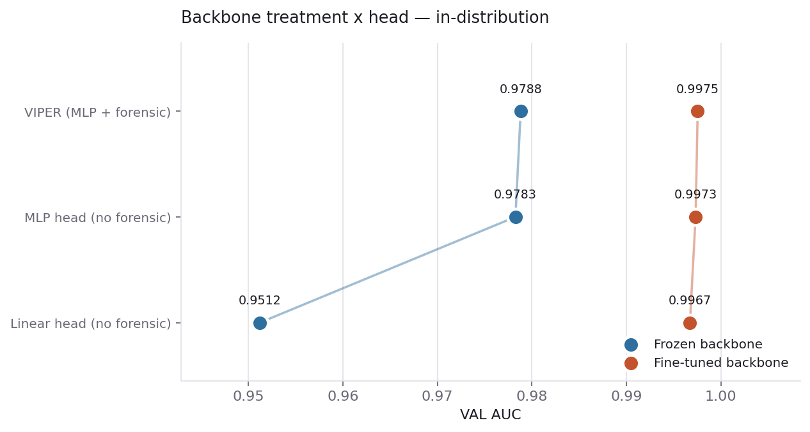
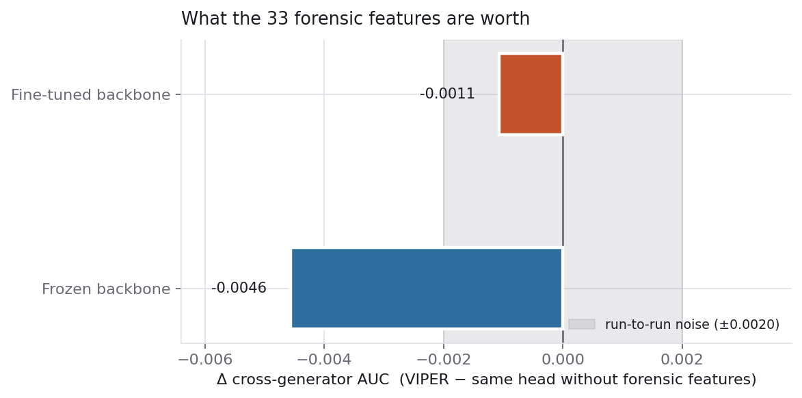
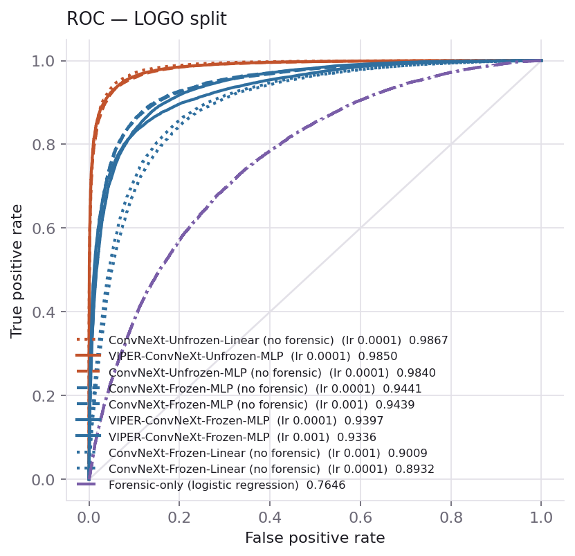
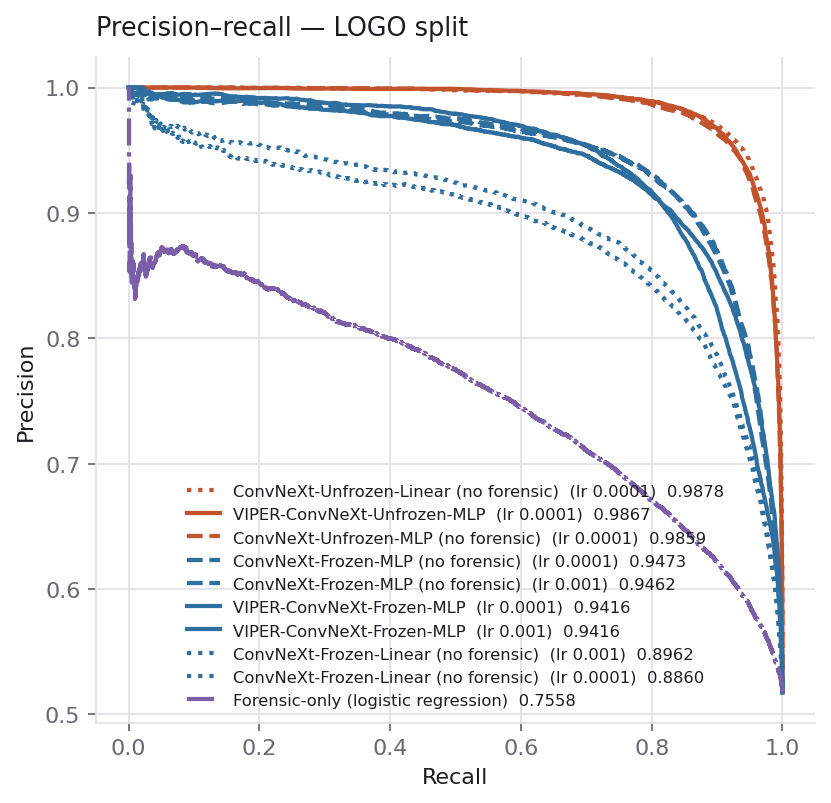
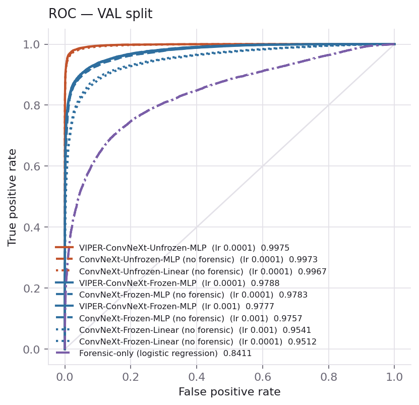
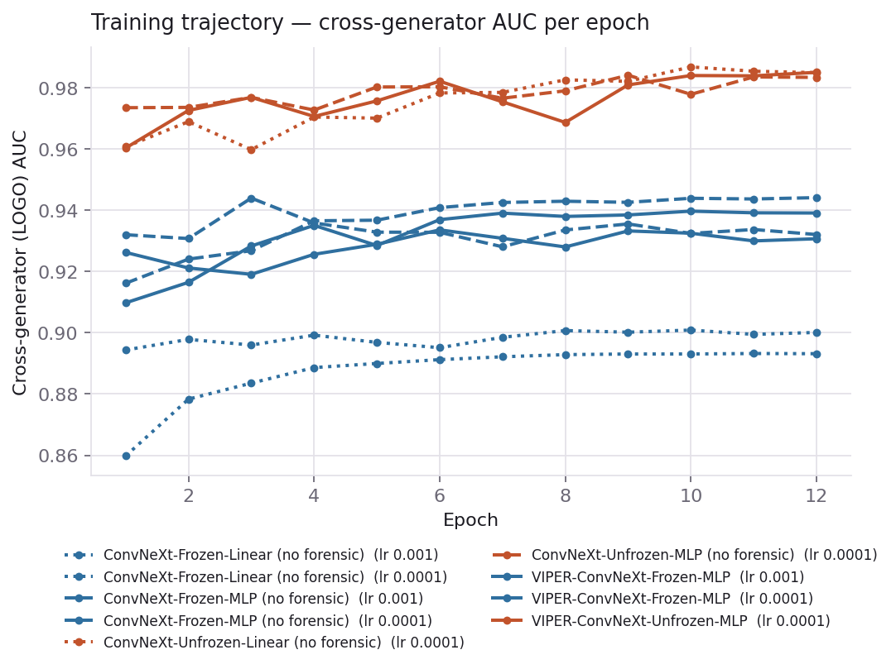
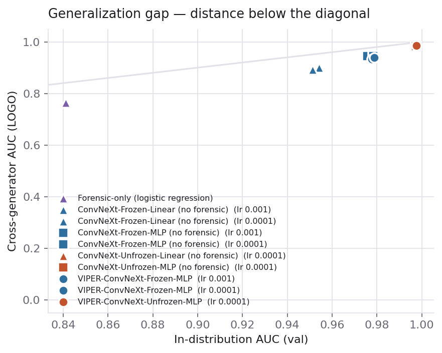
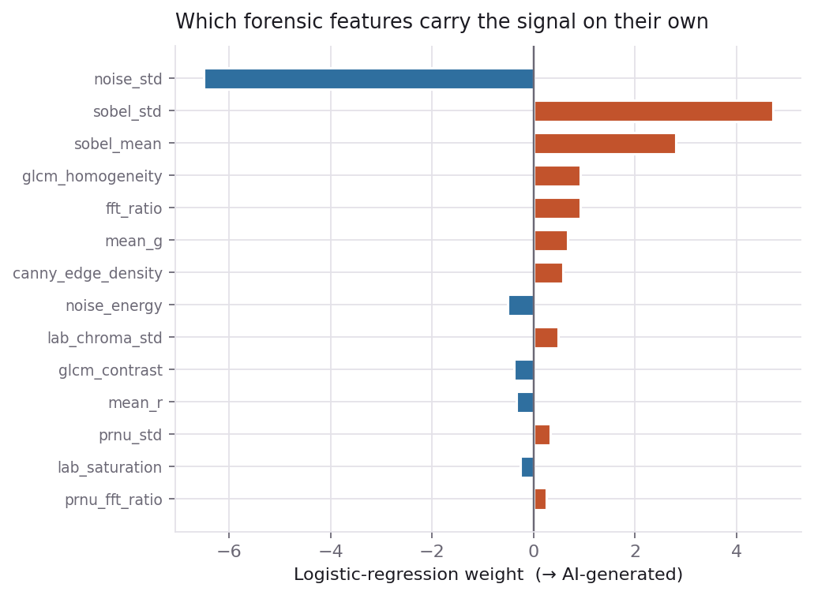
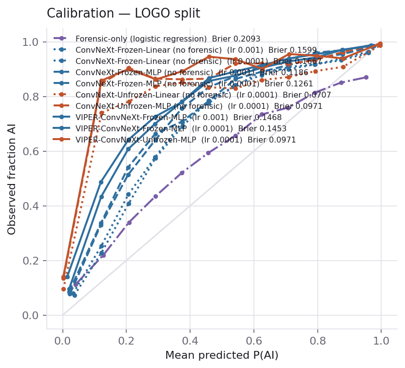

# VIPER — model comparison

Every model below is trained and evaluated on **one corpus build, one manifest and one seed**, so the numbers are directly comparable. The selection metric throughout is cross-generator (LOGO) AUC.

## Headline

- Forensic features are worth **-0.0046** LOGO AUC on a **frozen** backbone and **-0.0011** on a **fine-tuned** one.
- Run-to-run GPU nondeterminism on this setup is ±0.0020 AUC; read any delta smaller than that as zero.

- Best cross-generator model: **ConvNeXt-Unfrozen-Linear (no forensic)** at 0.9867 LOGO AUC (in-distribution val 0.9967).

## The freeze grid

Rows are the backbone treatment; columns are the head. Only the **VIPER** column has the forensic branch — the MLP column exists so a fusion gain cannot be an extra-layer gain in disguise.

Numbers are the **mean cross-generator AUC over the last five epochs**. Checkpointing on LOGO and reporting LOGO is optimistically biased (one arm spiked +0.010 above its own level on a single epoch); selecting on val instead breaks on the fine-tuned arms, where val saturates at ~0.997 and argmax becomes arbitrary. All three readings are in the sensitivity table below — the conclusion does not depend on which one you take.

| Backbone | LR | Linear head | MLP head | VIPER (MLP + forensic) | VIPER − MLP |
|---|---|---|---|---|---|
| Frozen | 0.001 | 0.9003 | 0.9334 | 0.9309 | -0.0026 |
| Frozen | 0.0001 | 0.8931 | 0.9434 | 0.9388 | -0.0046 |
| Fine-tuned | 0.0001 | 0.9843 | 0.9815 | 0.9804 | -0.0011 |

_Mean cross-generator (LOGO) AUC over epochs 8–12._

### Selection sensitivity

How much of each arm's headline number is a spike.

| Model | LR | last-5 mean | last-5 sd | best-LOGO (as run) | ep | val-selected LOGO | ep |
|---|---|---|---|---|---|---|---|
| ConvNeXt-Unfrozen-Linear (no forensic) | 0.0001 | 0.9843 | 0.0018 | 0.9867 | 10 | 0.9825 | 8 |
| ConvNeXt-Unfrozen-MLP (no forensic) | 0.0001 | 0.9815 | 0.0026 | 0.9840 | 9 | 0.9840 | 9 |
| VIPER-ConvNeXt-Unfrozen-MLP | 0.0001 | 0.9804 | 0.0061 | 0.9850 | 12 | 0.9838 | 11 |
| ConvNeXt-Frozen-MLP (no forensic) | 0.0001 | 0.9434 | 0.0006 | 0.9441 | 12 | 0.9441 | 12 |
| VIPER-ConvNeXt-Frozen-MLP | 0.0001 | 0.9388 | 0.0006 | 0.9397 | 10 | 0.9391 | 12 |
| ConvNeXt-Frozen-MLP (no forensic) | 0.001 | 0.9334 | 0.0012 | 0.9439 | 3 | 0.9324 | 10 |
| VIPER-ConvNeXt-Frozen-MLP | 0.001 | 0.9309 | 0.0019 | 0.9336 | 6 | 0.9336 | 6 |
| ConvNeXt-Frozen-Linear (no forensic) | 0.001 | 0.9003 | 0.0005 | 0.9009 | 10 | 0.9007 | 8 |
| ConvNeXt-Frozen-Linear (no forensic) | 0.0001 | 0.8931 | 0.0001 | 0.8932 | 11 | 0.8932 | 12 |

## What the forensic branch actually does

Split the effect by distribution. In every configuration tested, the forensic features **raise in-distribution AUC and lower cross-generator AUC** — three out of three, same sign on both sides, across two learning rates and both backbone treatments.

| Config | val: MLP | val: VIPER | Δval | LOGO: MLP | LOGO: VIPER | ΔLOGO |
|---|---|---|---|---|---|---|
| Frozen, lr 0.001 | 0.9765 | 0.9769 | +0.0004 | 0.9334 | 0.9309 | -0.0026 |
| Frozen, lr 0.0001 | 0.9781 | 0.9788 | +0.0007 | 0.9434 | 0.9388 | -0.0046 |
| Fine-tuned, lr 0.0001 | 0.9969 | 0.9973 | +0.0003 | 0.9815 | 0.9804 | -0.0011 |

That is the signature of a **generator-specific shortcut**. The 33 statistics — noise residuals, PRNU-style estimates, FFT band ratios — describe the fingerprint of the particular generators in the training set. The head learns to lean on them, which pays on generators it has seen and costs on generators it has not.

It is not that the features are noise. On their own they reach 0.7646 cross-generator AUC, far above chance. The problem is that what they add is precisely the part that does not transfer.

## Cross-generator split (LOGO) — held-out generators

Threshold metrics are at the deployed operating point, p ≥ 0.5. Class 1 is AI-generated.

| Model | LR | AUC | AP | Acc | BalAcc | Prec(AI) | Rec(AI) | F1(AI) | Prec(Real) | Rec(Real) | MCC | FPR | Brier |
|---|---|---|---|---|---|---|---|---|---|---|---|---|---|
| ConvNeXt-Unfrozen-Linear (no forensic) | 0.0001 | 0.9867 | 0.9878 | 0.9185 | 0.9206 | 0.9791 | 0.8609 | 0.9162 | 0.8679 | 0.9803 | 0.8441 | 0.0197 | 0.0707 |
| VIPER-ConvNeXt-Unfrozen-MLP | 0.0001 | 0.9850 | 0.9867 | 0.8915 | 0.8949 | 0.9889 | 0.7994 | 0.8841 | 0.8215 | 0.9904 | 0.8000 | 0.0096 | 0.0971 |
| ConvNeXt-Unfrozen-MLP (no forensic) | 0.0001 | 0.9840 | 0.9859 | 0.8892 | 0.8926 | 0.9872 | 0.7962 | 0.8815 | 0.8190 | 0.9890 | 0.7956 | 0.0110 | 0.0971 |
| ConvNeXt-Frozen-MLP (no forensic) | 0.0001 | 0.9441 | 0.9473 | 0.8268 | 0.8315 | 0.9544 | 0.6988 | 0.8069 | 0.7490 | 0.9642 | 0.6829 | 0.0358 | 0.1261 |
| ConvNeXt-Frozen-MLP (no forensic) | 0.001 | 0.9439 | 0.9462 | 0.8394 | 0.8434 | 0.9498 | 0.7282 | 0.8244 | 0.7668 | 0.9587 | 0.7016 | 0.0413 | 0.1186 |
| VIPER-ConvNeXt-Frozen-MLP | 0.0001 | 0.9397 | 0.9416 | 0.7971 | 0.8028 | 0.9548 | 0.6381 | 0.7649 | 0.7136 | 0.9676 | 0.6363 | 0.0324 | 0.1453 |
| VIPER-ConvNeXt-Frozen-MLP | 0.001 | 0.9336 | 0.9416 | 0.8084 | 0.8140 | 0.9614 | 0.6562 | 0.7800 | 0.7249 | 0.9717 | 0.6564 | 0.0283 | 0.1468 |
| ConvNeXt-Frozen-Linear (no forensic) | 0.001 | 0.9009 | 0.8962 | 0.7657 | 0.7714 | 0.9092 | 0.6079 | 0.7286 | 0.6897 | 0.9349 | 0.5701 | 0.0651 | 0.1599 |
| ConvNeXt-Frozen-Linear (no forensic) | 0.0001 | 0.8932 | 0.8860 | 0.7494 | 0.7556 | 0.9017 | 0.5790 | 0.7052 | 0.6737 | 0.9323 | 0.5424 | 0.0677 | 0.1667 |
| Forensic-only (logistic regression) | — | 0.7646 | 0.7558 | 0.6759 | 0.6806 | 0.7606 | 0.5454 | 0.6353 | 0.6259 | 0.8158 | 0.3736 | 0.1842 | 0.2093 |

_n = 40,000._

## In-distribution split (val)

Threshold metrics are at the deployed operating point, p ≥ 0.5. Class 1 is AI-generated.

| Model | LR | AUC | AP | Acc | BalAcc | Prec(AI) | Rec(AI) | F1(AI) | Prec(Real) | Rec(Real) | MCC | FPR | Brier |
|---|---|---|---|---|---|---|---|---|---|---|---|---|---|
| VIPER-ConvNeXt-Unfrozen-MLP | 0.0001 | 0.9975 | 0.9973 | 0.9774 | 0.9761 | 0.9874 | 0.9624 | 0.9747 | 0.9696 | 0.9898 | 0.9545 | 0.0102 | 0.0199 |
| ConvNeXt-Unfrozen-MLP (no forensic) | 0.0001 | 0.9973 | 0.9970 | 0.9755 | 0.9742 | 0.9850 | 0.9604 | 0.9725 | 0.9679 | 0.9879 | 0.9506 | 0.0121 | 0.0209 |
| ConvNeXt-Unfrozen-Linear (no forensic) | 0.0001 | 0.9967 | 0.9965 | 0.9753 | 0.9747 | 0.9772 | 0.9680 | 0.9726 | 0.9738 | 0.9813 | 0.9501 | 0.0187 | 0.0216 |
| VIPER-ConvNeXt-Frozen-MLP | 0.0001 | 0.9788 | 0.9783 | 0.9264 | 0.9221 | 0.9565 | 0.8771 | 0.9151 | 0.9050 | 0.9670 | 0.8528 | 0.0330 | 0.0548 |
| ConvNeXt-Frozen-MLP (no forensic) | 0.0001 | 0.9783 | 0.9775 | 0.9276 | 0.9235 | 0.9561 | 0.8803 | 0.9167 | 0.9072 | 0.9666 | 0.8551 | 0.0334 | 0.0552 |
| VIPER-ConvNeXt-Frozen-MLP | 0.001 | 0.9777 | 0.9777 | 0.9281 | 0.9234 | 0.9628 | 0.8748 | 0.9167 | 0.9039 | 0.9721 | 0.8567 | 0.0279 | 0.0558 |
| ConvNeXt-Frozen-MLP (no forensic) | 0.001 | 0.9757 | 0.9751 | 0.9252 | 0.9218 | 0.9453 | 0.8859 | 0.9147 | 0.9104 | 0.9577 | 0.8497 | 0.0423 | 0.0567 |
| ConvNeXt-Frozen-Linear (no forensic) | 0.001 | 0.9541 | 0.9556 | 0.8990 | 0.8953 | 0.9151 | 0.8562 | 0.8847 | 0.8873 | 0.9344 | 0.7964 | 0.0656 | 0.0770 |
| ConvNeXt-Frozen-Linear (no forensic) | 0.0001 | 0.9512 | 0.9530 | 0.8948 | 0.8909 | 0.9108 | 0.8507 | 0.8797 | 0.8830 | 0.9312 | 0.7878 | 0.0688 | 0.0804 |
| Forensic-only (logistic regression) | — | 0.8411 | 0.8447 | 0.7796 | 0.7751 | 0.7717 | 0.7281 | 0.7493 | 0.7855 | 0.8221 | 0.5537 | 0.1779 | 0.1570 |

## The threshold does not transfer

AUC is threshold-free, so it hides an operational problem. On val the best-F1 threshold sits near 0.5 and accuracy there matches accuracy at 0.5. On held-out generators the best threshold collapses toward 0 and accuracy at 0.5 falls 3–7 points below what the same model achieves at its own optimum.

| Model | val acc @0.5 | LOGO acc @0.5 | LOGO acc @best-F1 | best thr | LOGO recall(AI) @0.5 |
|---|---|---|---|---|---|
| ConvNeXt-Unfrozen-Linear (no forensic)  (lr 0.0001) | 0.9753 | 0.9185 | 0.9439 | 0.006 | 0.8609 |
| VIPER-ConvNeXt-Unfrozen-MLP  (lr 0.0001) | 0.9774 | 0.8915 | 0.9378 | 0.000 | 0.7994 |
| ConvNeXt-Unfrozen-MLP (no forensic)  (lr 0.0001) | 0.9755 | 0.8892 | 0.9375 | 0.002 | 0.7962 |
| ConvNeXt-Frozen-MLP (no forensic)  (lr 0.0001) | 0.9276 | 0.8268 | 0.8763 | 0.152 | 0.6988 |
| ConvNeXt-Frozen-MLP (no forensic)  (lr 0.001) | 0.9252 | 0.8394 | 0.8801 | 0.158 | 0.7282 |
| VIPER-ConvNeXt-Frozen-MLP  (lr 0.0001) | 0.9264 | 0.7971 | 0.8693 | 0.125 | 0.6381 |
| VIPER-ConvNeXt-Frozen-MLP  (lr 0.001) | 0.9281 | 0.8084 | 0.8608 | 0.089 | 0.6562 |
| ConvNeXt-Frozen-Linear (no forensic)  (lr 0.001) | 0.8990 | 0.7657 | 0.8253 | 0.182 | 0.6079 |
| ConvNeXt-Frozen-Linear (no forensic)  (lr 0.0001) | 0.8948 | 0.7494 | 0.8207 | 0.209 | 0.5790 |
| Forensic-only (logistic regression) | 0.7796 | 0.6759 | 0.6704 | 0.216 | 0.5454 |

Scores on unseen generators shift toward *real*: the model is not wrong about the ranking, it is underconfident. At the deployed p ≥ 0.5 the best model still misses **14%** of AI images from a generator it has never seen, and the frozen models miss 26–36%. Any deployment needs its threshold re-tuned per target distribution, or a calibration layer — the ranking quality alone does not carry over.

## Cost of each configuration

| Model | Trainable params | % of 27.8M total |
|---|---|---|
| ConvNeXt-Unfrozen-Linear (no forensic) | 26,586,626 | 95.56% |
| VIPER-ConvNeXt-Unfrozen-MLP | 26,893,826 | 95.61% |
| ConvNeXt-Unfrozen-MLP (no forensic) | 26,881,154 | 95.61% |
| ConvNeXt-Frozen-MLP (no forensic) | 296,066 | 1.05% |
| VIPER-ConvNeXt-Frozen-MLP | 308,738 | 1.10% |
| ConvNeXt-Frozen-Linear (no forensic) | 1,538 | 0.01% |

## Per held-out generator

Each generator is scored against the full real pool. This is where an averaged AUC hides its variance.

| Held-out generator | n fake | VIPER-Frozen | VIPER-Unfrozen | Δ |
|---|---|---|---|---|
| `GigaGAN` | 8,272 | 0.9315 | 0.9894 | -0.0579 |
| `BigGAN` | 4,848 | 0.9403 | 0.9691 | -0.0288 |
| `StyleGANXL` | 2,899 | 0.9195 | 0.9829 | -0.0634 |
| `StyleSANXL` | 2,794 | 0.9490 | 0.9920 | -0.0430 |
| `StyleGAN2` | 1,801 | 0.9906 | 0.9991 | -0.0085 |
| `tftgregrge/mpid-hassanblend-v1-5-better-train-3000` | 27 | 0.9895 | 0.9989 | -0.0093 |
| `FloydianSound/Aoi_Ogata_Artstyle_v1-5` | 22 | 0.9981 | 1.0000 | -0.0019 |
| `Charles-Elena/playground-v2-1024px-aesthetic-ce` | 21 | 0.9998 | 1.0000 | -0.0001 |

## What the forensic features encode

A logistic regression on the 33 features alone — no network — reaches **0.7646** LOGO AUC. That is the control separating *redundant* from *useless*.

| Feature | Weight (→ AI) |
|---|---|
| `noise_std` | -6.504 |
| `sobel_std` | +4.719 |
| `sobel_mean` | +2.806 |
| `glcm_homogeneity` | +0.924 |
| `fft_ratio` | +0.923 |
| `mean_g` | +0.679 |
| `canny_edge_density` | +0.576 |
| `noise_energy` | -0.509 |
| `lab_chroma_std` | +0.482 |
| `glcm_contrast` | -0.385 |
| `mean_r` | -0.339 |
| `prnu_std` | +0.329 |

## Corpus and splits

| Quantity | Value |
|---|---|
| Source | OwensLab/CommunityForensics-Small (CC-BY-NC-SA-4.0) |
| Rows after canonicalization | 556,541 |
| Near-duplicates dropped (pHash ≤ 4) | 1,610 |
| Split `train` | 388,288 |
| Split `val` | 76,093 |
| Split `balanced_out` | 1,184 |
| Split `logo` | 85,783 |
| Split `dropped_dup` | 1,610 |
| Split `capped_out` | 3,583 |

Canonicalization is `canon-v1:crop256-jpeg95-noexif` — a fixed JPEG encoder on every image, so the compression signature cannot be the feature the model learns.

## Charts

### grid logo auc

### grid val auc

### forensic delta

### roc logo

### pr logo

### roc val

### training curves

### per generator

### val vs logo

### forensic weights

### calibration logo

## Caveats

- **Reals are not group-aware.** The manifest carries no source label for real images, so they are split at random while fakes are split by generator. The LOGO number is therefore honest about unseen *generators*, not unseen *cameras*.
- **No commercial generator in the held-out set.** CF-Small contains none under a `Commercial` subset, so Midjourney/DALL·E-class models are untested here.
- **One seed.** Every arm shares the seed, which makes them comparable to each other but does not give a confidence interval on any single number. The ±0.0020 band comes from repeating one configuration.

